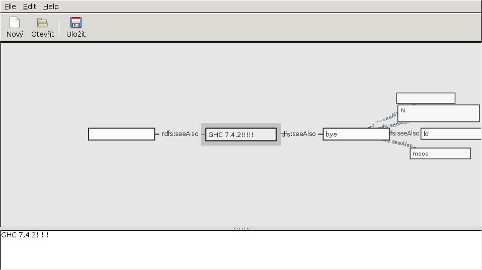

This resurection was successful:
======================

.fhs and .chs files
===================

.fhs and .chs are a file extentions hooked up to preprocessors by Setup.lhs

.fhs
--------

.fhs files are preprocessed by the custom preprocessor held in the Preprocessor directory.

.chs
--------
are preprocessed with the c2hs program.

Progress
--------

First error we come across when building is that:

    Setup.hs:3:8:
     Could not find module `Distribution.PreProcess'
        Use -v to see a list of the files searched for.
        Failed to install fenfire-0.1
        cabal: Error: some packages failed to install:
        fenfire-0.1 failed during the configure step. The exception was:
        ExitFailure 1

So we delete line 3 from Setup.hs and we look at what is now out of scope.

Before we get to that point, we find that `Distribution.Simple.Utils` does not export `rawSystemVerbose`

    Setup.hs:5:35:
     Module
        `Distribution.Simple.Utils'
        does not export
        `rawSystemVerbose'

So we google for `rawSystemVerbose` and we at least know what type it used to have: [The old docs for the function](http://cvs.haskell.org/Hugs/pages/libraries/Cabal/Distribution-Simple-Utils.html#v%3ArawSystemVerbose).  We learn that the `Int` in `rawSystemVerbose` is now `Verbosity` [from a man who had the same problem](http://berlinbrowndev.blogspot.cz/2008/02/haskell-hsqlsqlite-with-ghc-68-setup-is.html).  And we guess that `rawSystemVerbose` must now be [rawSystemExit](http://www.haskell.org/ghc/docs/7.0.2/html/libraries/Cabal-1.10.1.0/Distribution-Simple-Utils.html) which has the same type, except for the `Int` being replaced by a `Verbose`.

Now we're getting somewhere:

    Setup.hs:12:10:
        Not in scope: type constructor or class `PPSuffixHandler'

    Setup.hs:31:9:
        Not in scope: type constructor or class `PPSuffixHandler'

        Setup.hs:40:16: Not in scope: `withC2hs'

The new type for `PPSuffixHandler` is easy to find, as we can look at what the modern `defaultUserHooks` wants.  When we google, though, we find out that `defaultUserHooks` [is also depricated](http://www.haskell.org/pipermail/cabal-devel/2008-January/001916.html) but this is good for us, because we've found an email conversation that will tell us more about what it was replaced with: `simpleUserHooks`.  A simple [hayoo](http://holumbus.fh-wedel.de/hayoo/hayoo.html) search brings us to the [hadock page for Distribution.Simple](http://hackage.haskell.org/packages/archive/Cabal/latest/doc/html/Distribution-Simple.html#v:simpleUserHooks) and this in turn tells us that there is a module named `Distribution.Simple.PreProcess` which is almost certainly the same as the `Distribution.Preprocess` which we could not find at the beginning of this article.

Now off to find `withC2hs`.  DuckDuckGo sends us [here](http://www.haskell.org/ghc/docs/6.6/html/libraries/Cabal/Distribution-Simple-LocalBuildInfo.html#v%3AwithC2hs) and we learn that

    withC2hs :: (Maybe FilePath)	Might be the location of the C2hs executable.

Using tab completion in my terminal, I find that c2hs is indeed in my path. When reading [the documentation for c2hs](http://blog.ezyang.com/2010/06/setting-up-cabal-the-ffi-and-c2hs/) I become distracted by a tool I did not know about: [cabal-init](http://byorgey.wordpress.com/2010/04/15/cabal-init/) cool.  If we cannot get fenfire's cabal file working, we might try generating a new one.

Back to `c2hs`. From Brents post, it is clear that we no longer need to explicitly run `c2hs` in our `Setup.lhs` file. We only have to make sure that `Build-tools: c2hs` is in our cabal file.  So we'll delete the section on c2hs from the `Setup.lhs`.

This also means we no longer need to import `import Distribution.Simple.Utils (rawSystemExit,dieWithLocation)` making a lot of our previous work pointless.

Moving on to type errors:
--------------------------

    Setup.hs:13:17:
     Couldn't match expected type `PreProcessor'
                with actual type `[Char]
                                  -> [Char] -> a0 -> IO GHC.IO.Exception.ExitCode'
     Expected type: Distribution.PackageDescription.BuildInfo
                   -> LocalBuildInfo -> PreProcessor
       Actual type: Distribution.PackageDescription.BuildInfo
                   -> LocalBuildInfo
                   -> [Char]
                   -> [Char]
                   -> a0
                   -> IO GHC.IO.Exception.ExitCode
     In the expression: f
     In the expression: ("fhs", f)

The type of `PPSuffixHandler` has changed. Now that last part, with the two `FilePath`s and the `Verbosity` level must be moved over to a `PreProcessor` data constructor: described [here](http://hackage.haskell.org/packages/archive/Cabal/latest/doc/html/src/Distribution-Simple-PreProcess.html#PreProcessor).  We also have to change our verbosity checks to use the new `Verbosity` data types.  Luckly, `Verbosity` type has an Ord instance, so no logic must change.  All we do is replace `verbisity > 3` with `verbosity >= verbose` type has an Ord instance, so no logic must change.  All we do is replace `verbisity > 3` with `verbosity >= verbose` and `import Distribution.Verbosity`.

Setup.lhs now builds, but we're far from done
====================================

    Warning: No 'build-type' specified. If you do not need a custom Setup.hs or
    ./configure script then use 'build-type: Simple'.
    Warning: 'ghc-options: -hide-package' is never needed. Cabal hides all
    packages.
    setup: Missing dependency on a foreign library:
    * Missing C library: raptor
    This problem can usually be solved by installing the system package that
    provides this library (you may need the "-dev" version). If the library is
    already installed but in a non-standard location then you can use the flags
    --extra-include-dirs= and --extra-lib-dirs= to specify where it is.

Maybe we'll get to try out `cabal init` today afterall. But first we install raptor: `# pacman -S raptor`

At this point I decided to back up the old `.cabal` file and start afresh with `cabal init`.  It can't hurt afterall.

Everything goes fine untill we get to `Guessing dependencies...`

Which complains that:

    Warning: no package found providing Utils.

    Warning: no package found providing Cache.

    Warning: no package found providing Utils.

    Warning: no package found providing Preprocessor.Hsx.

    Warning: no package found providing Preprocessor.Hsx.Build.

    Warning: no package found providing Preprocessor.Hsx.Syntax.

    Warning: no package found providing Preprocessor.Hsx.Parser.

    Warning: no package found providing Preprocessor.Hsx.Pretty.

    Warning: no package found providing Preprocessor.Hsx.Transform.

    Warning: no package found providing Preprocessor.Hsx.Syntax.

    Warning: no package found providing Preprocessor.Hsx.Build.

    Warning: no package found providing HSP.Data.

That really got us nowhere.  So lets try to get the old cabal file working.

After changing the `Extra-Libraries: raptor` to `Extra-Libraries: raptor2` we get quite a ways into building this darn thing.  But it fails with an incomprehensible error `setup: dist/build/fenfire/fenfire-tmp: inappropriate type`.  Off to get rid of the warnings.

Finally it occurse to me that the error is due to my having edited `Setup.hs` incorrectly.  The preprocessed files are not being created at all.  Yep, increasing the verbosity in cabal `cabal install --v=3` tells us that I misunderstood the docs for `runPreProcessor` and am passing `./preprocessor` directory names instead of file names.

My next error was `dist/build/fenfire/fenfire-tmp/Raptor.chs.h:1:20: fatal error: raptor.h: Adresář nebo soubor neexistuje`
Fatal error: raptor.h: File or directory does not exist.

It occures to me, that I had installed the `raptor` package in arch linux, and changed the `Extra-Libraries:` to use `raptor2`  I guess that was a bad idea.  So I went back and found that arch linux also has a `raptor1` package.  Moving back to raptor1` got us this:

    Fenfire.fhs:1:41:
        Warning: -fallow-overlapping-instances is deprecated: use -XOverlappingInstances or pragma {-# LANGUAGE OverlappingInstances #-} instead

    Fenfire.fhs:1:41:
        Warning: -fimplicit-params is deprecated: use -XImplicitParams or pragma {-# LANGUAGE ImplicitParams #-} instead

    Fenfire.fhs:54:8:
        Could not find module `System.Random'
        It is a member of the hidden package `random-1.0.1.1'.
        Perhaps you need to add `random' to the build-depends in your .cabal file.
        Use -v to see a list of the files searched for.

I followed by slogging through many dozens of flag deprication warnings. What followed was

    Raptor.chs:128:9: parse error on input `import'

Line 128-129 of Raptor.chs

   foreign import ccall "wrapper"
       mkHandler :: (Handler a) -> IO (FunPtr (Handler a))

Google to the rescue [again](http://therning.org/magnus/archives/tag/c2hs)  I needed:

    {-# LANGUAGE ForeignFunctionInterface #-}

The next error is super interesting:
==========================

    Cache.hs:51:15: parse error on input `let'

This leads us to this weirdo bit of code.

    newList :: IO (LinkedList a)
    newList = mdo let end = End p n
                  p <- newIORef end; n <- newIORef end; list <- newIORef end
                  return list

I've never seen mdo before.  [It's a depricated recursive do notation.](http://www.haskell.org/ghc/docs/7.2.1/html/users_guide/syntax-extns.html) See "7.3.7.2.  Mdo-notation (deprecated)"  It turns out we probably want to use "recursive do notation" here.  Which is described in "7.3.7.1. Details of recursive do-notation" of the same page.

    newList :: IO (LinkedList a)
    newList = do
     rec let end = End p n
         p <- newIORef end
         n <- newIORef end
     list <- newIORef end
     return list

Now builds, though I'm still not sure if it will work.

After adding many more LANGUAGE pragmas and fixing some imports I get to a new nasty:

    Cairo.fhs:175:16:
        cannot find normal object file `dist/build/fenfire/fenfire-tmp/FunctorSugar.o'
        while linking an interpreted expression

In `dist/build/fenfire/fenfire-tmp/FunctorSugar.o` there is a `.p_o` file but no `.o` file.  Time to look up what `.p_o` means.  From the google results, it looks like .p_o files have to do with profiling, which I have enabled in GHC.  I try turning it off with [csghc noprofiling-default](https://github.com/timthelion/config-select/blob/master/README.md)

This gets us some new errors, though most of these warnings are probably just displaying again since cabal is working from a clean dist and thus compiles everything:

    Cairo.fhs:117:9:
        Warning: This binding for `f' shadows the existing binding
                   bound at Cairo.fhs:114:11

    Cairo.fhs:158:44:
        Warning: Defaulting the following constraint(s) to type `Double'
                   (Fractional a0) arising from the literal `0.5'
        In the Template Haskell quotation [| 0.5 |]
        In the first argument of `FunctorSugar.functorSugar', namely
          `[| 0.5 |]'
        In the expression: FunctorSugar.functorSugar [| 0.5 |]

    Cairo.fhs:159:39:
        Warning: Defaulting the following constraint(s) to type `Double'
                   (Fractional a0) arising from the literal `0.5'
        In the Template Haskell quotation [| 0.5 |]
        In the first argument of `FunctorSugar.functorSugar', namely
          `[| 0.5 |]'
        In the expression: FunctorSugar.functorSugar [| 0.5 |]

    Cairo.fhs:175:45:
        Warning: Defaulting the following constraint(s) to type `Integer'
                   (Num a0) arising from the literal `0'
        In the Template Haskell quotation [| 0 |]
        In the first argument of `FunctorSugar.functorSugar', namely
          `[| 0 |]'
        In the expression: FunctorSugar.functorSugar [| 0 |]

    Cairo.fhs:176:44:
        Warning: Defaulting the following constraint(s) to type `Double'
                   (Floating a0) arising from a use of `pi' at Cairo.fhs:176:44-45
                   (Num a0) arising from a use of `*' at Cairo.fhs:176:42
        In the second argument of `(*)', namely `pi'
        In the Template Haskell quotation [| (2 * pi) |]
        In the first argument of `FunctorSugar.functorSugar', namely
          `[| (2 * pi) |]'

    Cairo.fhs:192:47:
        Warning: Defaulting the following constraint(s) to type `Integer'
                   (Num a0) arising from the literal `0'
        In the Template Haskell quotation [| 0 |]
        In the first argument of `FunctorSugar.functorSugar', namely
          `[| 0 |]'
        In the expression: FunctorSugar.functorSugar [| 0 |]

    Cairo.fhs:193:42:
        Warning: Defaulting the following constraint(s) to type `Integer'
                   (Num a0) arising from the literal `0'
        In the Template Haskell quotation [| 0 |]
        In the first argument of `FunctorSugar.functorSugar', namely
          `[| 0 |]'
        In the expression: FunctorSugar.functorSugar [| 0 |]

    Cairo.fhs:196:49:
        Warning: Defaulting the following constraint(s) to type `Integer'
                   (Num a0) arising from the literal `0'
        In the Template Haskell quotation [| 0 |]
        In the first argument of `FunctorSugar.functorSugar', namely
          `[| 0 |]'
        In the expression: FunctorSugar.functorSugar [| 0 |]

    Cairo.fhs:197:44:
        Warning: Defaulting the following constraint(s) to type `Integer'
                   (Num a0) arising from the literal `1'
        In the Template Haskell quotation [| 1 |]
        In the first argument of `FunctorSugar.functorSugar', namely
          `[| 1 |]'
        In the expression: FunctorSugar.functorSugar [| 1 |]

    Cairo.fhs:200:49:
        Warning: Defaulting the following constraint(s) to type `Integer'
                   (Num a0) arising from the literal `1'
        In the Template Haskell quotation [| 1 |]
        In the first argument of `FunctorSugar.functorSugar', namely
          `[| 1 |]'
        In the expression: FunctorSugar.functorSugar [| 1 |]

    Cairo.fhs:201:44:
        Warning: Defaulting the following constraint(s) to type `Integer'
                   (Num a0) arising from the literal `1'
        In the Template Haskell quotation [| 1 |]
        In the first argument of `FunctorSugar.functorSugar', namely
          `[| 1 |]'
        In the expression: FunctorSugar.functorSugar [| 1 |]

    Cairo.fhs:204:49:
        Warning: Defaulting the following constraint(s) to type `Integer'
                   (Num a0) arising from the literal `1'
        In the Template Haskell quotation [| 1 |]
        In the first argument of `FunctorSugar.functorSugar', namely
          `[| 1 |]'
        In the expression: FunctorSugar.functorSugar [| 1 |]

    Cairo.fhs:205:44:
        Warning: Defaulting the following constraint(s) to type `Integer'
                   (Num a0) arising from the literal `0'
        In the Template Haskell quotation [| 0 |]
        In the first argument of `FunctorSugar.functorSugar', namely
          `[| 0 |]'
        In the expression: FunctorSugar.functorSugar [| 0 |]

    Cairo.fhs:208:49:
        Warning: Defaulting the following constraint(s) to type `Integer'
                   (Num a0) arising from the literal `0'
        In the Template Haskell quotation [| 0 |]
        In the first argument of `FunctorSugar.functorSugar', namely
          `[| 0 |]'
        In the expression: FunctorSugar.functorSugar [| 0 |]

    Cairo.fhs:209:44:
        Warning: Defaulting the following constraint(s) to type `Integer'
                   (Num a0) arising from the literal `0'
        In the Template Haskell quotation [| 0 |]
        In the first argument of `FunctorSugar.functorSugar', namely
          `[| 0 |]'
        In the expression: FunctorSugar.functorSugar [| 0 |]

    Cairo.fhs:55:10:
        Warning: orphan instance: instance [incoherent] Monoid (Render ())

    Cairo.fhs:59:10:
        Warning: orphan instance:
          instance [incoherent] (Applicative m, Monoid o) => Monoid (m o)
    [8 of 9] Compiling Vobs             ( dist/build/fenfire/fenfire-tmp/Vobs.hs, dist/build/fenfire/fenfire-tmp/Vobs.o )

    Vobs.fhs:331:35: parse error on input `<-'

I ignore the warnings and look at the error.  Another `mdo` is at fault.  We know how to fix this problem by now.

Another error:

    dist/build/fenfire/fenfire-tmp/Vobs.hs:1:1:
        File name does not match module name:
        Saw: `Main'
        Expected: `Vobs'

Looking at `dist/build/fenfire/fenfire-tmp/Vobs.hs`
the file is empty.  `./preprocessor` clearly didn't like something here.
==========================================

Trying out the preprocessor by hand we get an overlooked error:

    $ ./preprocessor Vobs.fhs Vobs.hs
    preprocessor: Error at SrcLoc {srcFilename = "Vobs.fhs", srcLine = 330, srcColumn = 28}:
    Parse error in pattern: HsVar (UnQual (HsIdent "rec"))

That's the place I just removed the mdo.  It doesn't recognize the new rec syntax!

When we had a problem with mdo before, it was in `Cache.hs` which doesn't have to go through the preprocessor.  Now we'll have to see how we can help this old guys parser along.  Time to look at `.ly` files!

Unfortunately, adding

    >	'rec'		{ KW_Rec }

To our `.ly` file at line 182 right after the `>	'mdo'		{ KW_MDo }` didn't help nor did similar trivial changes in the rest of the file, and lexer.hs help(though the runtime errors I got did change...)

    grep MDo *

tells us that MDo statements are dealt with in:

* Lexer.hs
* Parser.ly
* Parser.hs  -- No need to edit this it is autogenerated by happy
* ParserUtils.hs
* Pretty.hs
* Syntax.hs
* Transform.hs

After duplicating all `mdo` code to support the `rec` keyword as well we're back in business(I hope).

Now onto other things, we discover an outdated an unecessary `Show` instance for `gtk2hs`'s `Modifier` data.

After wading through more banalities we find:

    Vobs.fhs:122:32:
        Couldn't match expected type `MaybeT
                                        (Reader (RenderContext k)) (Maybe t0)'
                    with actual type `Maybe a0'
        In the return type of a call of `Map.lookup'
        In the second argument of `(=<<)', namely
          `Map.lookup key (rcScene cx)'
        In a stmt of a 'do' block:
          rect <- maybeReturn =<< Map.lookup key (rcScene cx)

    Vobs.fhs:160:17:
        The function `C.fill' is applied to one argument,
        but its type `C.Render ()' has none
        In the first argument of `useBgColor', namely `(C.fill extents)'
        In the first argument of `(&)', namely
          `useBgColor (C.fill extents)'
        In the first argument of `(&)', namely
          `useBgColor (C.fill extents) & clip extents vob'

The seccond error was due to my own carelessness. I acidentally hooked up the `fill` token to `Graphics.Rendering.Cairo` when I wanted to use the custom `fill` function described in `Cairo.fhs`.

The first error appears to relate to these lines:
================================================

    (@@) :: Ord k => Cx k a -> k -> Cx k a   -- pronounce as 'of'
    (@@) x key = do cx <- ask
                    rect <- maybeReturn =<< Map.lookup key (rcScene cx)
                    local (\_ -> cx { rcRect = rect }) 

Cx is defined in the same file as:

    type Cx k     = MaybeT (Reader (RenderContext k))

And maybeReturn is defined in `Utils.hs` as:

    maybeReturn :: MonadPlus m => Maybe a -> m a
    maybeReturn = maybe mzero return

TODO TODO Fix this!
-----------------

I changed the lines to this

    (@@) :: Ord k => Cx k a -> k -> Cx k a   -- pronounce as 'of'
    (@@) x key = do cx <- ask
                    rectM <- maybeReturn $ Map.lookup key (rcScene cx)
                    case rectM of
                     Just rect ->
                      local (\_ -> cx { rcRect = rect }) x

Then I had to go through the code fixing ambiguous instances where `Control.Exception.catch` was used.  That is, replace `show e`s with `show (e::Control.Exception.IOException)`s

And finally I had an executable.  Still not sure if it'll run :D

AND IT OPENS!!!!
------------------

It runs!!!

And it's fast!
======================

Clean up.
============
* Remove all `mdo` stuff from the preprocessor's code.
Fix `(@@)`

I also I noticed that it wasn't saving things and restoring them correctly
===================================

Tuukka Hastrup, one of the old authors mentioned to me, that the [RDF stuff](http://www.w3.org/TR/rdf-mt/) might not be up to par.  I didn't like the fact that we were using raptor1 in the first place for RDF support.  It makes no sense for Haskell, which is good at data manipulation, to be handing C, which isn't so great at data manipulation, a data manipulation task.  At least, when there is no real performance barrier to usign Haskell.

Since fenfire was written, Haskell has gotten [it's own RDF support](http://hackage.haskell.org/package/rdf4h-1.1.0)  So I decided to try migrating to using that instead.
